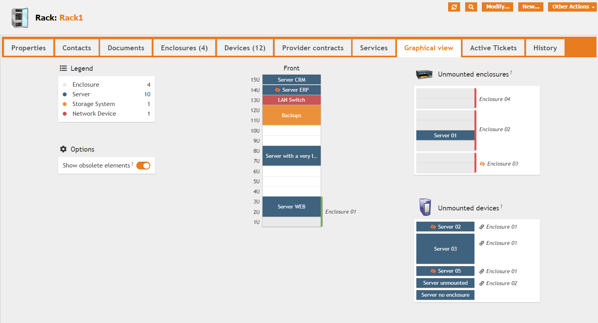
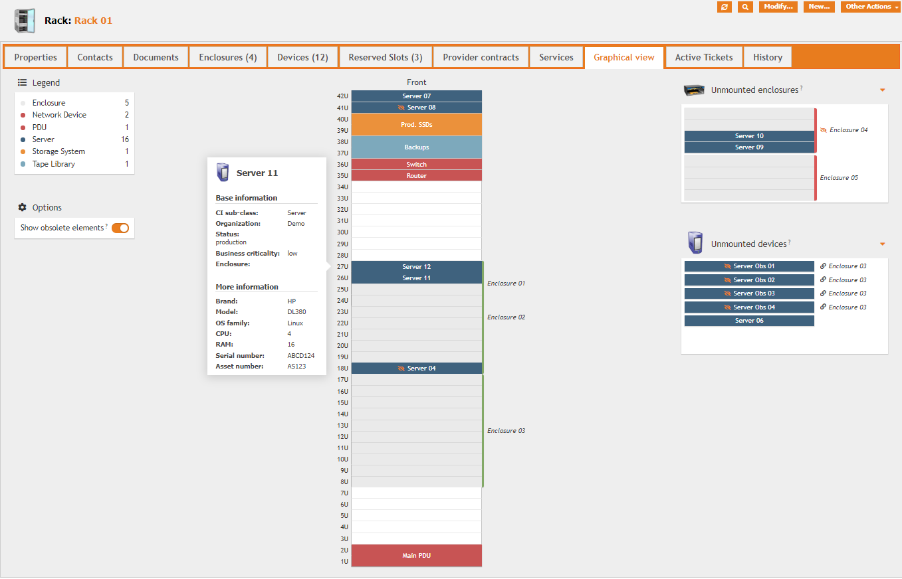
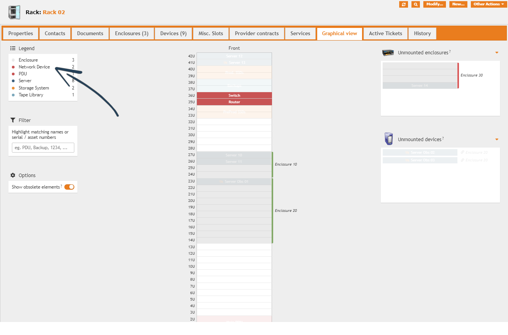

👋 Available on [iTop Hub](https://store.itophub.io/en_US/products/molkobain-datacenter-view) and [Molkobain I/O](https://www.molkobain.com/product/datacenter-view/)

# iTop extension: molkobain-datacenter-view

  * [Description](#description)
  * [Advanced features](#advanced-features-in-the-paid-version-)
  * [Online demo](#online-demo)
  * [Downloads](#download-the-extension)
  * [Installation & configuration](#installation--configuration)
  * [Tutorials](#tutorials)
  * [Contributors](#contributors)
  * [Dependencies & third parties](#dependencies)

## Support
If you like this project, you can buy me beer, always appreciated! 🍻😁

## Description
Easily manage & visualize your racks, enclosures and datacenter devices.

  * See at a glace where your devices are.
  * Check which attached devices have no position set.
  * Toggle obsolete devices easily.
  * Full support of english, french, dutch, german, czech & swedish languages.
  * External applications like racktables or rackmonkey are no longer necessary to visualize your data.

Access device's main information on hover (customizable)

Identify specific devices type by hovering the legend

Highlight devices based on their name / serial number / asset number

### Advanced features in the paid version 🚀
Full presentation & documentation available of the advanced features are available [here](https://molkobain.github.io/itop-extensions-documentation/molkobain-datacenter-view-extended/).

  * [Drag & Drop](https://molkobain.github.io/itop-extensions-documentation/molkobain-datacenter-view-extended/docs/features/drag-and-drop.html)
  * [Complex enclosures support (grid system)](https://molkobain.github.io/itop-extensions-documentation/molkobain-datacenter-view-extended/docs/features/complex-enclosures.html)
  * [Rear panel support](https://molkobain.github.io/itop-extensions-documentation/molkobain-datacenter-view-extended/docs/features/graphical-tab-overview.html)
  * [Occupancy rates](https://molkobain.github.io/itop-extensions-documentation/molkobain-datacenter-view-extended/docs/features/occupancy-rates.html)
  * [Power & weight capacities](https://molkobain.github.io/itop-extensions-documentation/molkobain-datacenter-view-extended/#documentation)
  * [Consistency checks & audit rules](https://molkobain.github.io/itop-extensions-documentation/molkobain-datacenter-view-extended/#documentation)
  * [Reserved slots & Zero-U devices](https://molkobain.github.io/itop-extensions-documentation/molkobain-datacenter-view-extended/#documentation)
  * [And more](https://molkobain.github.io/itop-extensions-documentation/molkobain-datacenter-view-extended/#documentation)

👋 _Paid version is now available on [iTop Hub](https://store.itophub.io/en_US/products/molkobain-datacenter-view-extended)!_

## Online demo
You can try this extension on the online demo. There are already some racks, enclosures and devices mounted as an example. Just click on the links below to access it:

  * [Administration console](http://mbc.itop.molkobain.com/pages/UI.php?operation=details&class=Rack&id=15&c[menu]=SearchCIs&auth_user=admin&auth_pwd=admin#tabbedContent_0=8) (admin / admin)

## Download the extension
Stable releases can be found either on the [releases page](https://github.com/Molkobain/itop-datacenter-view/releases) or on [Molkobain I/O](https://www.molkobain.com/product/datacenter-view/).

Downloading it directly from the *Clone or download* will get you the version under development which might be unstable.

## Installation & configuration

  * [Installation](docs/configuration/installation.md)
  * [Datamodel changes](docs/configuration/datamodel-changes.md)
  * [Configuration parameters](docs/configuration/configuration-parameters.md)
  * [Change log](CHANGELOG.md)

## Tutorials

  * [Position a device on a rack](docs/tutorials/position-device-on-rack.md)

## Contributors
I would like to give a special thank you to the people who contributed to this

### Names

 * Abello, Stephen  a.k.a [@steffunky](https://github.com/steffunky)
 * Beer, Christian a.k.a [@ChristianBeer](https://github.com/ChristianBeer)
 * Bostoen, Jeffrey a.k.a [@jbostoen](https://github.com/jbostoen)
 * Casteleyn, Thomas a.k.a [@Hipska](https://github.com/Hipska)
 * Makhlouf, Hadi
 * Sedlak, Zdenek a.k.a [@xmstspider](https://github.com/xmstspider)
 * Schirrmann, Pascal a.k.a [@Schirrms](https://github.com/Schirrms)
   
### Aliases

 * [@danama](https://github.com/danama)

### Companies

 * [viwedis GmbH](https://www.viwedis.de/)

## Licensing
This extension is under [AGPLv3](https://en.wikipedia.org/wiki/GNU_Affero_General_Public_License).

## Dependencies
This extension embeds some resources that are necessary for it to work. \
Everything is included in the distributed packages, no extra effort needed.

### iTop modules

  * Module [molkobain-console-tooltips](https://github.com/Molkobain/itop-console-tooltips)
  * Module [molkobain-datacenter-view-bridge-for-combodo-location-hierarchy](https://github.com/Molkobain/itop-datacenter-view-bridge-for-combodo-location-hierarchy)
  * Module [molkobain-fontawesome5-pack](https://github.com/Molkobain/itop-fontawesome5-pack)
  * Module [molkobain-handy-framework](https://github.com/Molkobain/itop-handy-framework)
  * Module [molkobain-newsroom-provider](https://github.com/Molkobain/itop-newsroom-provider)

### Third parties

  * Zero-U panel icon (USB memory stick) comes from [Icons8](https://icons8.com/icon/FlnYHAW3wYBn/usb-memory-stick)
  * Some class icons come from [Icons8](https://icons8.com)
  