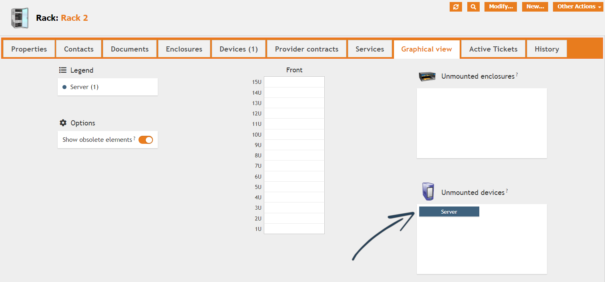
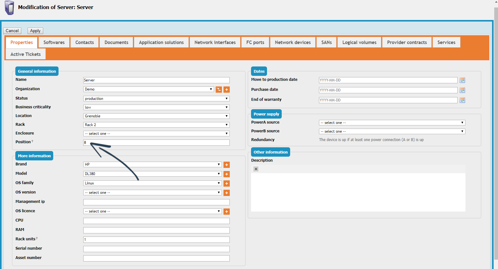
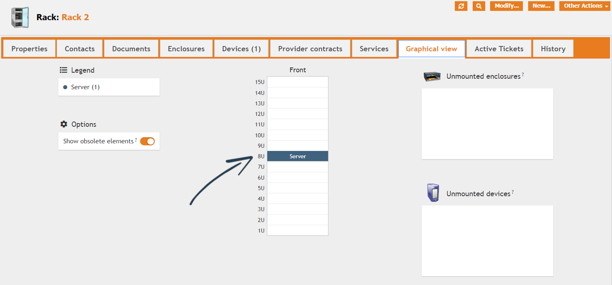

<button onclick="history.back()">Back</button>

# Tutorial: Position a device on a rack
A quick example to show how to manually position a device on a rack.

In this example, the *Rack 2* has a *Server* attached but is listed among the *unmounted* devices. This is because the *server* has no *position* set.

To fix this, edit the *server* and make sure it has both *position* and *rack units* (its height) set.

Save the object and go back to the *rack*. The *server* will now appear in the *front* panel!
